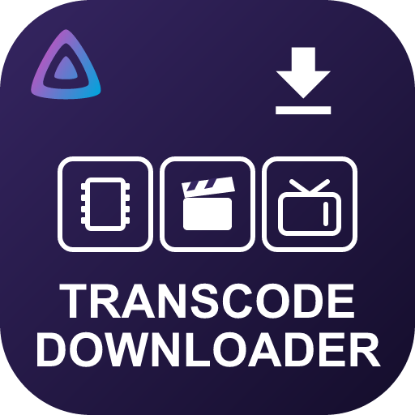

<p align="center"></p>

<h1 align="center">Transcode Downloader</h1>

<p align="center">
  A Jellyfin plugin that adds a <b>quality picker</b> to the Download button — grab the
  <b>original</b>, or a smaller <b>server-side transcode</b>, straight from the web UI and the
  official mobile apps.
</p>

<p align="center">
  
  
  
</p>

---

Jellyfin's built-in download only gives you the **original file**, which is often far too
large for a phone or tablet. **Transcode Downloader** lets you pick a size — **Original /
480p / 720p / 1080p / 4K** (all configurable) — and transcodes it on the server using
Jellyfin's own encoder (NVENC / QSV / VAAPI / software), then hands you a clean,
ready-to-play **MP4**.

> **Where it works:** the **Jellyfin web client** and the **official Android & iOS apps**
> (which embed the web UI). It does **not** appear in fully-native third-party clients
> (Findroid, Streamyfin, the native Android TV app), because Jellyfin has no client-side
> plugin API — the button is injected into the web UI.

## Features

- 🎚️ **Quality picker** on the existing **Download** action — no duplicate buttons.
- 📦 **Original** option = Jellyfin's normal direct download (no transcode).
- 🎬 Server-side transcode to a **faststart MP4** (seekable, correct duration, proper
  filenames including `Show SxxExx Title`).
- 🚫 **No upscaling** — qualities above the source resolution are hidden automatically.
- ⏳ **Progress bar + cancel** (cancelling stops ffmpeg immediately and frees the slot).
- ⚙️ **Configurable** presets, bitrates, codec, concurrency, retention — from the dashboard.
- 🔑 **No API key needed** — the plugin runs inside Jellyfin and uses your session.

## How to use

1. Open a **movie** or **episode**.
2. Click **Download**.
3. Choose **Original**, or a transcode quality (480p / 720p / 1080p / 4K).
4. A progress bar runs — you can cancel — and the file downloads when it's ready.

## Requirements

- **Jellyfin 10.11.x**.
- A working transcoding setup on your server (hardware acceleration recommended).
- The **[File Transformation](https://github.com/IAmParadox27/jellyfin-plugin-file-transformation)**
  plugin — strongly recommended. It lets this plugin inject its button into the web UI in
  memory, without write access to the web root (which is read-only in most Docker images).
  Without it, the plugin falls back to patching `index.html` directly, which only works if
  that file is writable.

## Installation

In the Jellyfin web UI, as an administrator. You'll add **two** plugin repositories — the
helper first, then this plugin.

### 1. Add the File Transformation repository

**Dashboard → Plugins → Repositories → ➕** and add:

```
https://www.iamparadox.dev/jellyfin/plugins/manifest.json
```

### 2. Add the Transcode Downloader repository

**Repositories → ➕** again, and add:

```
https://raw.githubusercontent.com/mitchfixapp/jellyfin-plugin-transcode-downloader/main/manifest.json
```

### 3. Install both plugins

**Dashboard → Plugins → Catalog** → install **File Transformation**, then **Transcode
Downloader**.

### 4. Restart Jellyfin

Restart the server (or the container). Afterwards both plugins should show **Active** under
**Dashboard → Plugins → My Plugins**.

### 5. Done

Open a movie or episode and click **Download** — you'll get the quality picker.

## Configuration

**Dashboard → Plugins → Transcode Downloader:**

| Setting | Description |
|---|---|
| **Video codec** | `h264` (most compatible) or `hevc` (smaller). |
| **Audio bitrate / channels** | Output audio; 2 channels = stereo downmix for phones. |
| **Offer "Original"** | Show the direct, non-transcoded download option. |
| **Max concurrent transcodes** | How many run at once (takes effect after a restart). |
| **Orphan timeout** | Auto-cancel a transcode whose dialog stopped polling (closed/abandoned). |
| **Delete finished files after (days)** | Retention; a scheduled task removes completed transcodes. |
| **Work folder** | Where temporary transcodes are written (default: cache folder). |
| **Quality presets (JSON)** | `label`, `maxHeight`, `minSourceWidth` (anti-upscale gate), `videoBitrate` (bits/sec). |

## Troubleshooting

- **No "quality" picker on the Download button** → make sure **File Transformation** is
  installed and you **restarted** Jellyfin.
- **Transcode fails** → check the Jellyfin log for lines tagged `[TranscodeDownloader]`;
  they say exactly what went wrong (source codec, ffmpeg, etc.).
- **Using HTTPS via a reverse proxy?** Everything is same-origin, so it works — just make
  sure the plugin endpoints under `/TranscodeDownloader` aren't blocked by the proxy.

## How it works

The plugin exposes an authenticated API under `/TranscodeDownloader`. When you pick a
quality it asks Jellyfin's own progressive transcode endpoint for that resolution/bitrate
(so HDR tone-mapping, hardware acceleration and audio downmixing are handled by Jellyfin),
pipes the result through `ffmpeg -c copy -movflags +faststart` into a proper MP4, and serves
it with a real `Content-Length` (so you get a progress bar and resumable downloads). The
button itself is a small script injected into the web UI.

## Building from source

Requires the **.NET 9 SDK**.

```bash
dotnet publish Jellyfin.Plugin.TranscodeDownloader/Jellyfin.Plugin.TranscodeDownloader.csproj -c Release -o publish
```

Copy `publish/Jellyfin.Plugin.TranscodeDownloader.dll` (and `Newtonsoft.Json.dll`) into a
folder under your Jellyfin `plugins` directory and restart. Tagged releases (`vX.Y.Z`) are
built and published automatically by GitHub Actions, which also updates `manifest.json` and
reads the release notes from [`CHANGELOG.md`](CHANGELOG.md).

## License

**Dual-licensed:**

- **Free** under the **GNU AGPL-3.0** ([LICENSE](LICENSE)) for personal, home, and non-profit
  use. Copyleft applies: if you distribute or run a modified version as a service, you must
  share your source.
- For **closed-source or commercial** use without the AGPL obligations, a separate
  **commercial license** is available — see [COMMERCIAL.md](COMMERCIAL.md).

© 2026 Mitchell Doedens.
