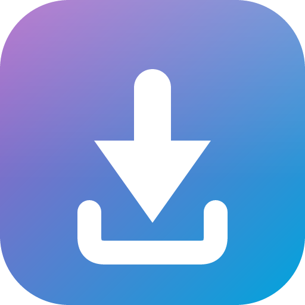

<p align="center"></p>

# Transcode Downloader (Jellyfin plugin)

Download a **smaller, server-side transcoded** version of a movie or episode — or the original —
straight from the Jellyfin web UI and the official mobile apps. Jellyfin's native download only
gives you the original file, which is often far too large for a phone or tablet. This plugin adds a
quality picker (**Original / 480p / 720p / 1080p / 4K**, configurable) and transcodes on the server
using Jellyfin's own encoder (NVENC / QSV / VAAPI / software — whatever your server is configured for).

> Works in the **Jellyfin web client** and the **official Android/iOS apps** (which embed the web UI).
> It does **not** appear in fully-native third-party clients, because Jellyfin has no client-side
> plugin API — the button is injected into the web UI.

## Features

- Hijacks the existing **Download** action (toolbar button + "…" menu) — no duplicate buttons.
- **Original** option = Jellyfin's native direct download (no transcode).
- Server-side transcode to a clean, seekable **MP4 with faststart** (proper filenames, incl. `Show SxxExx Title`).
- **No upscaling**: quality options above the source resolution are hidden.
- **Progress bar + cancel** (cancelling kills ffmpeg and frees the slot immediately).
- Configurable presets/bitrates, concurrency, audio, retention/cleanup — all in the dashboard.
- **No API key needed**: the plugin runs inside Jellyfin and uses your session.

## Requirements

- **Jellyfin 10.11.x** (built against `Jellyfin.Controller` 10.11, `net9.0`).
- A working transcoding setup on your server (hardware accel recommended).
- **[File Transformation plugin](https://github.com/IAmParadox27/jellyfin-plugin-file-transformation)** — strongly recommended.
  It lets this plugin inject its button into the web UI in-memory, without needing write access to the
  web root (the lsio/Docker web root is usually read-only for the Jellyfin process). Without it, the
  plugin falls back to patching `index.html` directly, which only works if that file is writable.

## Installation

1. In Jellyfin: **Dashboard → Plugins → Repositories → +** and add this URL:
   ```
   https://raw.githubusercontent.com/mitchfixapp/jellyfin-plugin-transcode-downloader/main/manifest.json
   ```
2. **Dashboard → Plugins → Catalog** → install **Transcode Downloader** (and **File Transformation** if you haven't).
3. **Restart Jellyfin.**
4. Open a movie or episode, click **Download**, and pick a quality.

## Configuration

**Dashboard → Plugins → Transcode Downloader:**

| Setting | Description |
|---|---|
| Video codec | `h264` (most compatible) or `hevc` (smaller). |
| Audio bitrate / Max audio channels | Output audio; 2 channels = stereo downmix for phones. |
| Offer "Original" | Show the direct, non-transcoded download option. |
| Max concurrent transcodes | How many run at once (takes effect after a restart). |
| Orphan timeout | Auto-cancel a transcode whose dialog stopped polling (closed/abandoned). |
| Delete finished files after (days) | Retention for completed transcodes; a cleanup task removes them. |
| Work folder | Where temporary transcodes are written (default: cache folder). |
| Quality presets (JSON) | `label`, `maxHeight`, `minSourceWidth` (anti-upscale gate), `videoBitrate` (bits/sec). |

## How it works

The plugin exposes an authenticated API under `/TranscodeDownloader`. When you pick a quality it asks
Jellyfin's own progressive transcode endpoint for that resolution/bitrate (so HDR tone-mapping, hardware
acceleration and audio downmixing are all handled by Jellyfin), pipes the result through
`ffmpeg -c copy -movflags +faststart` into a proper MP4, and serves it as a download with a real
`Content-Length` (so you get a progress bar and resumable downloads). The button itself is a small script
injected into the web UI.

## Build from source

Requires the .NET 9 SDK.

```bash
dotnet publish Jellyfin.Plugin.TranscodeDownloader/Jellyfin.Plugin.TranscodeDownloader.csproj -c Release -o publish
```

Copy `publish/Jellyfin.Plugin.TranscodeDownloader.dll` (and `Newtonsoft.Json.dll`) into a folder under your
Jellyfin `plugins` directory and restart. Tagged releases (`vX.Y.Z`) are built and published automatically
by GitHub Actions, which also updates `manifest.json`.

## License

**Dual-licensed.** Free under the **GNU AGPL-3.0** for personal, home, and non-profit
use (see [LICENSE](LICENSE)) — with copyleft: if you distribute or run a modified
version as a service, you must share your source. For **closed-source or commercial**
use without the AGPL obligations, a separate **commercial license** is available.
See [COMMERCIAL.md](COMMERCIAL.md).
